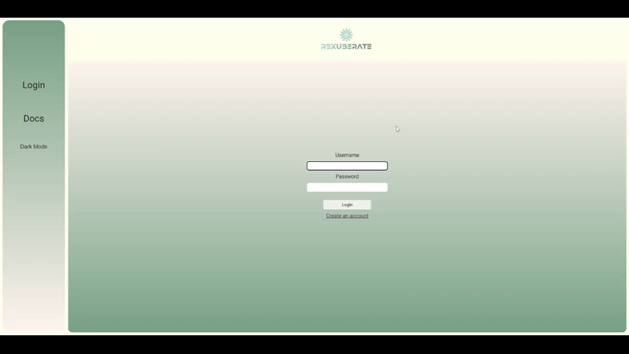
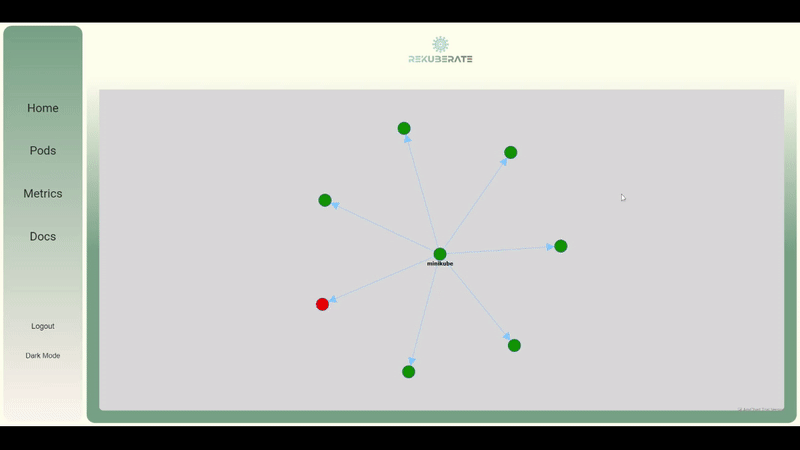

### The power of Kubernetes, visualized on your screen. Scale effortlessly, debug painlessly.

<a href="https://github.com/open-source-labs/ReKuberate/issues">Report Bug</a>
·
<a href="https://rekuberate.org">Documentation</a>

## ReKuberate

ReKuberate is a GUI that visualizes your kubernetes clusters in real time, allowing you to quickly see and diagnose problems and exactly where they're located. The hierarchy of the cluster is displayed straightforward, with each node and pod color-coordinated, and with additional information on hover. Curated metrics on pod status and cluster health is also available. Compiled with electron and available for both windows and macOS, downloading, installing, and initializing ReKuberate is quick and simple.

## About

First time setup of ReKuberate will require an initial log in. Log in data is hashed and authenticated with bCrypt. Select the file location of where the application is downloaded and initiate data scraping from your kubernetes cluster. Make sure your cluster is running or else no data will be collected.

The nodes will be color-coded: **red**: error, **yellow**: pending, **green**: running.

Hovering over each node will display additional details.

The metrics page displays selected data information displayed in a graph form to give you a quick and easy overview of your cluster health and computer usage.

## Install

Installation is incredible simple

1. Head over to <a href="https://rekuberate.org">ReKuberate.org</a>
2. Click on download
3. Extract the zip file
4. Open the extracted folder in VSCode
5. Install dependencies with 'npm install'
6. Start the application with 'npm run electron'
7. Enjoy!
8. If the metrics do not load but the boxes appear, try going to http://localhost:9000 and logging in with **username:** admin, **password:** prom-operator

## Technologies

## Built with ♥

Thad White | <a href='https://github.com/thadd225'>Github</a> | <a href='https://www.linkedin.com/in/thad-white/'>LinkedIn</a> 
Fabrizzio Quintanilla | <a href='https://github.com/Fab3005'>Github</a> | <a href='https://www.linkedin.com/in/fabrizzio-quintanilla-b58388244/'>LinkedIn</a> 
Hunter Shaw | <a href='https://github.com/HShaw215'>Github</a> | <a href='https://www.linkedin.com/in/hunter-shaw-39430a181/'>LinkedIn</a> 
Kai Farrell | <a href='https://github.com/farrellkai'>Github</a> | <a href='https://www.linkedin.com/in/kaifarrell/'>LinkedIn</a> 
Kevin Fan | <a href='https://github.com/kfan1'>Github</a> | <a href='https://www.linkedin.com/in/kfan1/'>LinkedIn</a> 
